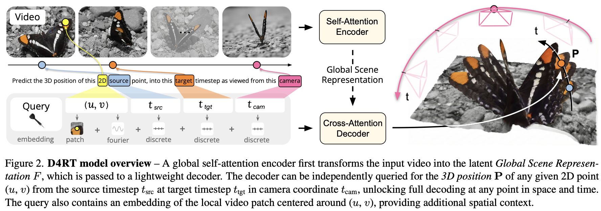

</img>

## d4rt (wip)

Implementation of [D4RT](https://d4rt-paper.github.io/), Efficiently Reconstructing Dynamic Scenes, Deepmind

## install

```shell
$ pip install d4rt
```

## usage

```python
import torch
from d4rt import D4RT

model = D4RT(
    dim = 512,
    video_image_size = 128,
    video_patch_size = 32,
    video_max_time_len = 10,
    enc_depth = 6,
    dec_depth = 6
)

videos = torch.randn(2, 10, 3, 128, 128)
points = torch.randn(2, 5, 3)
queries = torch.randn(2, 5, 512)

loss = model(
    videos,
    coors = torch.randint(0, 128, (2, 5, 2)),
    time_src = torch.randint(0, 10, (2, 5)),
    time_tgt = torch.randint(0, 10, (2, 5)),
    time_camera = torch.randint(0, 10, (2, 5)),
    points = points
)

loss.backward()

pred = model(videos, queries = queries) # (2, 5, 3)
assert pred.shape == (2, 5, 3)
```

## citations

```bibtex
@article{zhang2025d4rt,
    title   = {Efficiently Reconstructing Dynamic Scenes One D4RT at a Time},
    author  = {Zhang, Chuhan and Le Moing, Guillaume and Koppula, Skanda and Rocco, Ignacio and Momeni, Liliane and Xie, Junyu and Sun, Shuyang and Sukthankar, Rahul and Barral, Jo{\"e}lle K. and Hadsell, Raia and Ghahramani, Zoubin and Zisserman, Andrew and Zhang, Junlin and Sajjadi, Mehdi S. M.},
    journal = {arXiv preprint},
    year    = {2025}
}
```

```bibtex
@inproceedings{liu2026geometryaware,
    title   = {Geometry-aware 4D Video Generation for Robot Manipulation},
    author  = {Zeyi Liu and Shuang Li and Eric Cousineau and Siyuan Feng and Benjamin Burchfiel and Shuran Song},
    booktitle = {The Fourteenth International Conference on Learning Representations},
    year    = {2026},
    url     = {https://openreview.net/forum?id=18gC6pZVVc}
}
```
